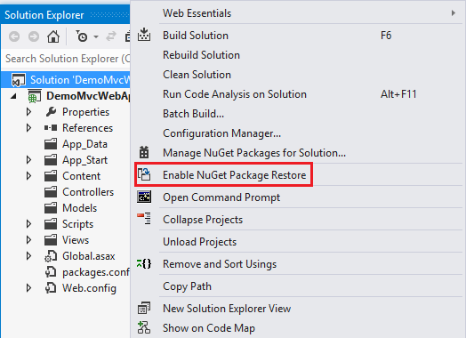

Usage - Example
----
Let's go through the steps in a built -> test -> deployment process

### Build... and stuff ###
First we'll need to generate the artifacts.

1) In Visual Studio, enable nuget package restore. Right click on the solution in the solution explorer and then select "Enable Package Restore". **This needs to be checked into source control**
  

2) and then in the Visual Studio package manager, run:
```
Install-Package Kaiseki
```
3) Open PowerShell at root of your solution and run
```
.\kaiseki-bootstrap\build.ps1
```
4) You'll see two folders  
- CiArtefact > Contains the file you need to collect as build artifacts  
- CiOutput > Contains test and analysis results and test coverage report  
5) Copy the CiArtefact folder to another place to simulate build server artifact gathering. The rest of the steps will only use assets from this folder.

### Moar Testing!!! ###
The unit tests are usually run with the build, but there are often integration and end to end testing that require other components such as SQL Server / IIS / Redis / etc, you name it. To do this, retrieve the archived artifacts and run:
```
.\CiArtefact\kkm-defaults\Run-NUnitTests.ps1 -TestCategory "EndToEnd"
```
Note this stage does not generate coverage report as the type of tests run here are generally not worth reporting test coverage on.

### Deployment - YEEHAWWWWWW!!!! ###
```
.\CiArtefact\kkm-defaults\Deploy-WebDeploy.ps1 -target dev-iis.contoso.net -username user -password pass -xmlsuffix dev
```
Note this assumes there's a server with hostname dev.contoso.net and Site.SetParameters.dev.xml in the CiWebDeploy folder.
### Push Nuget ###
```
.\CiArtefact\kkm-defaults\Deploy-Nuget.ps1 -server dev-nuget.contoso.net -password pass
```